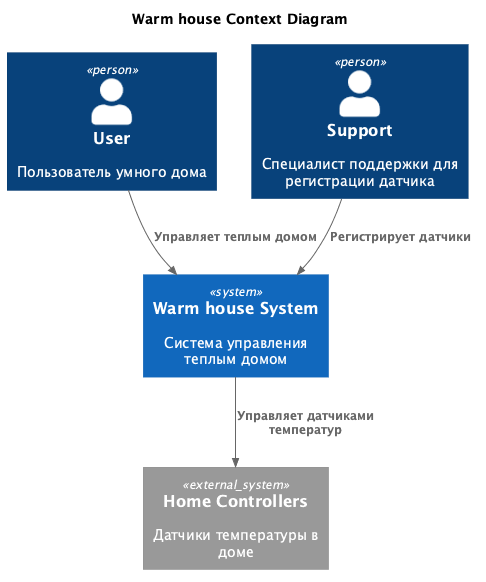
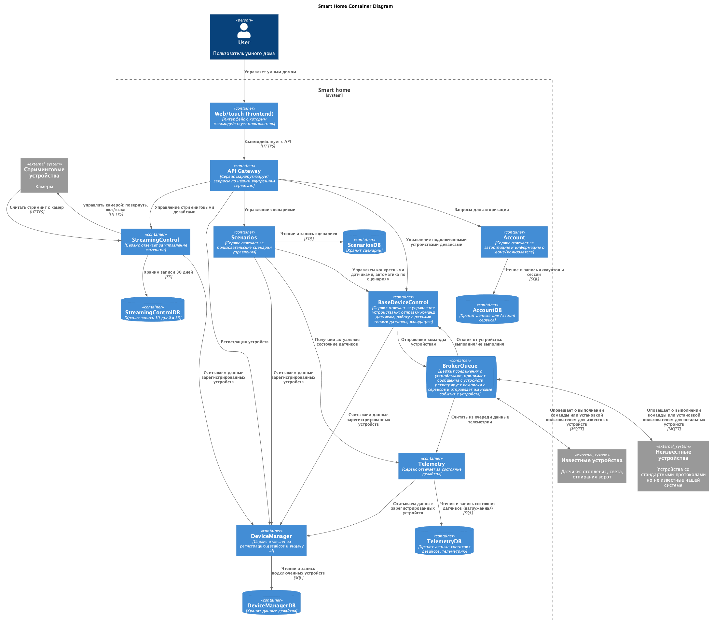
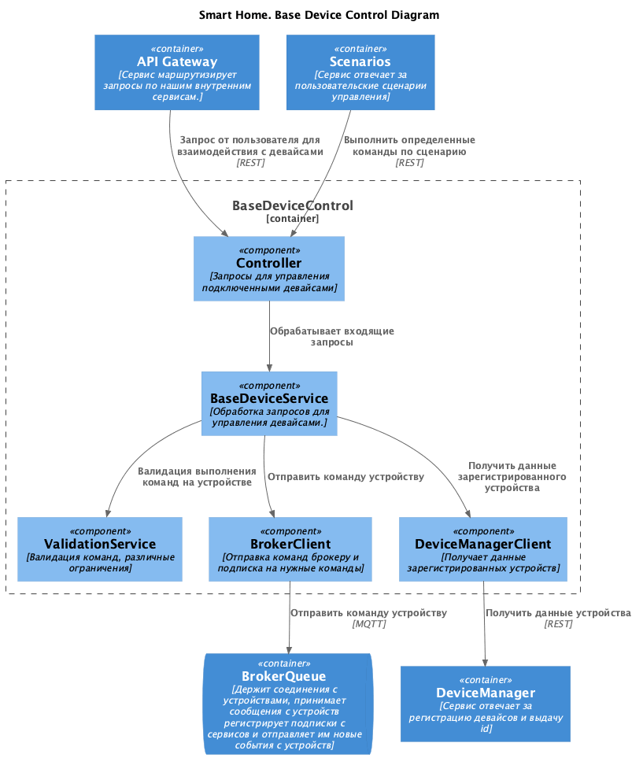
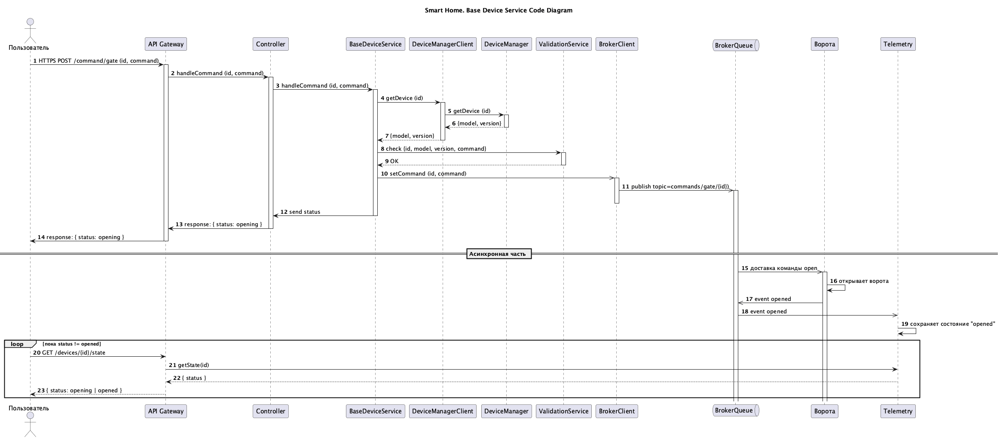
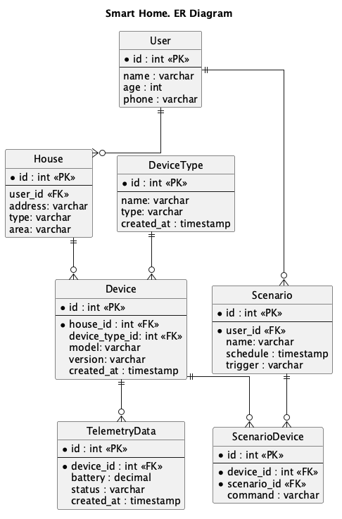

# Project_template

Это шаблон для решения проектной работы. Структура этого файла повторяет структуру заданий. Заполняйте его по мере работы над решением.

# Задание 1. Анализ и планирование

<aside>

Чтобы составить документ с описанием текущей архитектуры приложения, можно часть информации взять из описания компании и условия задания. Это нормально.

</aside

### 1. Описание функциональности монолитного приложения

**Управление отоплением:**

- Пользователи могут:
1. Управлять отоплением
2. Проверять температуру

- Система поддерживает:
1. Подключение устройства при помощи специалиста
2. Отдавать данные для просмотра данных с сенсоров. 


**Мониторинг температуры:**

- Пользователи могут:
1. Пользователи могут просматривать текущую температуру в своих домах через веб-интерфейс

- Система поддерживает:
1. Получение данные о температуре с датчиков, установленных в домах. 

### 2. Анализ архитектуры монолитного приложения

Перечислите здесь основные особенности текущего приложения: какой язык программирования используется, какая база данных, как организовано взаимодействие между компонентами и так далее.
1. Язык программирования: Golang
2. БД: PostgreSQL
3. Взаимодействие: Синхронное, запросы обрабатываются последовательно, к внешней системе temperature-api ходим по HTTP
4. Масштабируемость: Ограничена, так как монолит сложно масштабировать по частям.
5. Развертывание: Требует остановки всего приложения.
6. Архитектура: Монолитная, все компоненты системы (обработка запросов, бизнес-логика, работа с данными) находятся в рамках одного приложения.


### 3. Определение доменов и границы контекстов
Опишите здесь домены, которые вы выделили.

##### AS IS
Домен: Мониторинг температуры
  входит: 
	- Отображение данных температуры 

Домен: Управление отоплением
  входит: 
	- Изменение температуры
	- Регистрация отопления при помощи специалиста

##### TO BE 
Домен: Аккаунт дома
  входит: 
    - информация о доме: адрес, возможности

Домен: Управление устройствами
  входит: 
    - управление всеми подключенными датчиками
    - Регистрация/удаление датчиков 

Домен: Телеметрия
  входит: 
    - состояние каждого из устройств

Домен: Сценарии 
  входит: 
	- описание сценариев работы системы:
		- утром теплее, вечером прохладней
		- после 19:00 уменьшить яркость и запереть двери

Домен: Отопление 
  входит: 
    - Сделать теплее/холодней

Домен: Освещение
  входит: 
    - включить/выключить свет
	- изменить яркость 

Домен: Стриминг
  входит: 
    - показывать в реально времени данные с камеры
	- сохранить запись 
	- повернуть камеру 


Домен: Ворота
  входит: 
    - открыть/закрыть ворота

Домен: Внешние модули
  входит: 
    - поддержка стандартных протоколов.

### **4. Проблемы монолитного решения**

- Отсутствие независимого деплоя: сейчас все сразу публикуется 
- Отсутствие масштабирования: нельзя отдельно поднять несколько сервисов мониторинга
- Для регистрации нового оборудования нужен выезд специалиста (это дорого)
- Функциональность заточена только под изменение температуры

Если вы считаете, что текущее решение не вызывает проблем, аргументируйте свою позицию.

### 5. Визуализация контекста системы — диаграмма С4

Добавьте сюда диаграмму контекста в модели C4.

Чтобы добавить ссылку в файл Readme.md, нужно использовать синтаксис Markdown. Это делают так:



<!-- Команда для генерации перед отправкой -->
<!-- plantuml -tpng ./diagrams/01_context/context.puml -->

# Задание 2. Проектирование микросервисной архитектуры

В этом задании вам нужно предоставить только диаграммы в модели C4. Мы не просим вас отдельно описывать получившиеся микросервисы и то, как вы определили взаимодействия между компонентами To-Be системы. Если вы правильно подготовите диаграммы C4, они и так это покажут.

**Диаграмма контейнеров (Containers)**



**Диаграмма компонентов (Components)**



**Диаграмма кода (Code)**


# Задание 3. Разработка ER-диаграммы

Добавьте сюда ER-диаграмму. Она должна отражать ключевые сущности системы, их атрибуты и тип связей между ними.



# Задание 4. Создание и документирование API

### 1. Тип API

Укажите, какой тип API вы будете использовать для взаимодействия микросервисов. Объясните своё решение.
Используется 2 типа API:
- **REST (OpenAPI)** — для синхронных операций, где клиенту нужен немедленный ответ:
  регистрация устройства, отправка команды, чтение состояния, управление сценариями.
- **AsyncAPI** — для асинхронных событий через брокер сообщений, где немедленный ответ
  не требуется: публикация телеметрии устройствами, событие изменения состояния устройства.

Ручки для **REST**:
- POST /devices — зарегистрировать устройство (DeviceManager)
- GET /devices/{id} — получить устройство
- POST /devices/{id}/commands — отправить команду (BaseDeviceControl)
- GET /devices — текущее состояние всех устройств пользователя
- POST /scenarios — создать сценарий
- POST /scenarios/{id} — обновить сценарий


### 2. Документация API

Здесь приложите ссылки на документацию API для микросервисов, которые вы спроектировали в первой части проектной работы. Для документирования используйте Swagger/OpenAPI или AsyncAPI.

[Документация API (OpenAPI)](./api/openapi.yaml)

# Задание 5. Работа с docker и docker-compose

Перейдите в apps.

Там находится приложение-монолит для работы с датчиками температуры. В README.md описано как запустить решение.

Вам нужно:

1) сделать простое приложение temperature-api на любом удобном для вас языке программирования, которое при запросе /temperature?location= будет отдавать рандомное значение температуры.

Locations - название комнаты, sensorId - идентификатор названия комнаты

```
	// If no location is provided, use a default based on sensor ID
	if location == "" {
		switch sensorID {
		case "1":
			location = "Living Room"
		case "2":
			location = "Bedroom"
		case "3":
			location = "Kitchen"
		default:
			location = "Unknown"
		}
	}

	// If no sensor ID is provided, generate one based on location
	if sensorID == "" {
		switch location {
		case "Living Room":
			sensorID = "1"
		case "Bedroom":
			sensorID = "2"
		case "Kitchen":
			sensorID = "3"
		default:
			sensorID = "0"
		}
	}
```

2) Приложение следует упаковать в Docker и добавить в docker-compose. Порт по умолчанию должен быть 8081

3) Кроме того для smart_home приложения требуется база данных - добавьте в docker-compose файл настройки для запуска postgres с указанием скрипта инициализации ./smart_home/init.sql

Для проверки можно использовать Postman коллекцию smarthome-api.postman_collection.json и вызвать:

- Create Sensor
- Get All Sensors

Должно при каждом вызове отображаться разное значение температуры

Ревьюер будет проверять точно так же.


# **Задание 6. Разработка MVP**

Необходимо создать новые микросервисы и обеспечить их интеграции с существующим монолитом для плавного перехода к микросервисной архитектуре. 

### **Что нужно сделать**

1. Создайте новые микросервисы для управления телеметрией и устройствами (с простейшей логикой), которые будут интегрированы с существующим монолитным приложением. Каждый микросервис на своем ООП языке.
2. Обеспечьте взаимодействие между микросервисами и монолитом (при желании с помощью брокера сообщений), чтобы постепенно перенести функциональность из монолита в микросервисы. 

В результате у вас должны быть созданы Dockerfiles и docker-compose для запуска микросервисов. 

Создал:
- telemetry сервис для хранения телеметрии
	- доступен http://localhost:8083/telemetry
- device-manager
	- доступен http://localhost:8082/devices
- broker через RabbitMQ
	- доступен тут http://localhost:15672/#/connections
- gateway для фронтендов
	- http://localhost:8000/svc/telemetry/telemetry
- нагенерил фронтенд с эмитацией посылки показания датчиков (напрямую в брокер)
	- доступен http://localhost:8085
- нагенерил фронтенд с запросами (чтобы удобно было смотреть через UI, а не постман)
	- доступен http://localhost:8086
